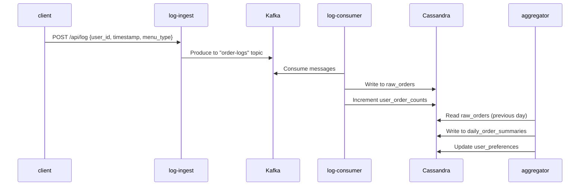
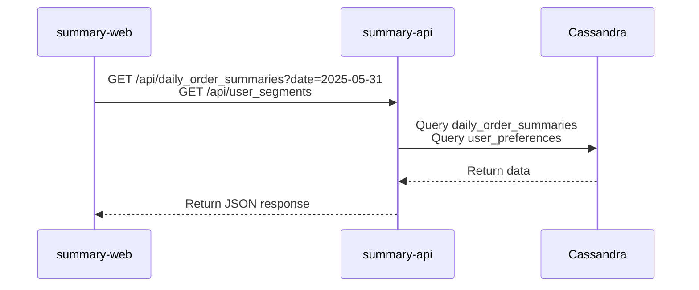

# analyze-poc

## 目的

注文ログをもとに、ユーザーの嗜好、日毎の注文状況を抽出・可視化する POC を構築。

### 習得したいスタック

- Kafka による非同期処理
- Cassandra によるデータ管理

## ユースケース

- 和食の注文数、洋食の注文数について日次のデータを閲覧できる。（前日の注文ログを集計）
- 注文ログをもとに、各ユーザーの嗜好（和食派/洋食派）を判定。それぞれの数、該当するユーザー ID をリスト表示できる。（前日の注文ログを元に毎晩差分更新）

### 活用方法

- 洋食と和食のどちらが好まれているのか、そのトレンドを把握する
- ユーザーの嗜好に基づいたマーケティング施策の検討（ex, 嗜好に応じた適切なクーポンの配布）

## サービス構成

- **log-ingest (Go)**: 注文ログを受信し、Kafka にプロデュースする API サービス
- **log-consumer (Go)**: Kafka から注文ログを消費し、Cassandra に永続化するサービス
- **aggregator (Python)**: 前日の注文データを集計し、サマリーデータを生成するバッチ処理サービス
- **summary-api (Go)**: 集計済みデータをクライアントに提供する API サービス
- **summary-web (Vue.js)**: 集計データを可視化する Web フロントエンド

## アーキテクチャ概要

```text
[log-stream-test.sh]
    ↓ loop: POST /api/log { user_id, timestamp, menu_type }

[services/log-ingest (Go, Echo)]
    ↓ Kafka “order-logs” トピックへプロデュース

[services/log-consumer (Go)]
    ↓ Cassandra raw_orders に書き込み、user_order_counts をインクリメント

[services/aggregator（Python）]
    ↓ 前日のraw_orders を集計、daily_order_summaries に書き込み
    ↓ 前日のraw_orders を集計、注文があったユーザーのuser_preferences を更新

[services/summary-api (Go, Echo)]
    • GET /api/daily_order_summaries?date=2025-05-31
    {
        summaries: [
            {
                date: "2025-05-30",
                counts: [
                    { menu_type: "washoku", count: 456 },
                    { menu_type: "yoshoku", count: 321 }
                ]
            },
            ...
        ]
    }
    • GET /api/user_segments
    {
        segments: [
            { menu_type: "washoku", count: 123, user_ids: [u1, u2, ...] },
            { menu_type: "yoshoku", count: 87, user_ids: [u3, u4, ...] }
        ]
    }
[services/summary-web (Vue.js 3, Chart.js)]
    • /daily_order_summaries
        日毎の和食／洋食注文数を円グラフで表示。カレンダーで年月日を選択可能。
    • /user_segments
        和食派／洋食派のユーザー ID リストを表示。セレクトボックスで「和食派」「洋食派」を選択可能。
```





## データモデル (Cassandra)

[schema def](/cassandra/init/01_create_keyspace_and_tables.cql)

## 動作確認

- 初期化
  ```bash
  # コンテナビルド、起動
  make dbu-containers
  # Kafka トピック作成
  make create-topics
  # Cassandra スキーマ作成：
  make init-cassandra
  ```
- ログストリーム再現
  ```bash
  ./log-stream-test.sh 2025-05-31
  ```
- 集計クエリ実行
  ```bash
  make run-aggregator date=2025-05-31
  ```
- レポート UI で確認：http://localhost:8081/
