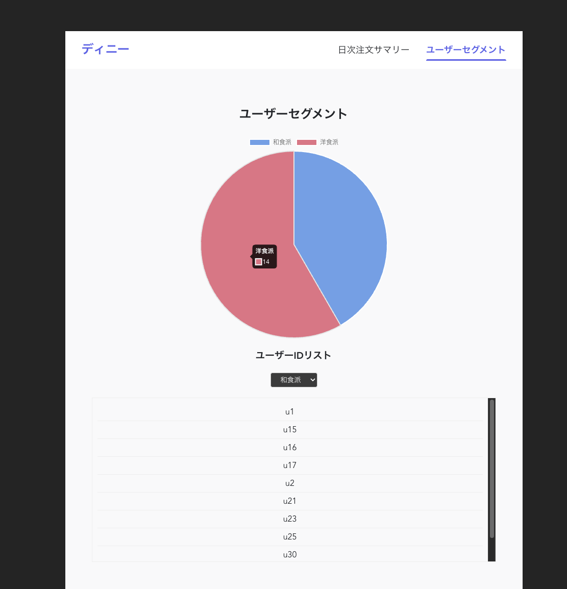
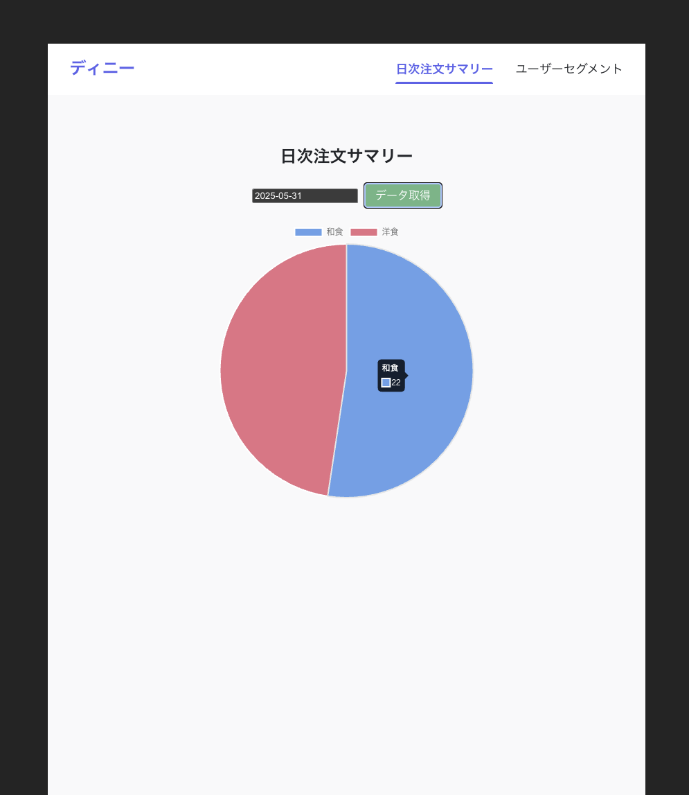

# analyze-poc

## 目的

注文ログをもとに、ユーザーの嗜好、日毎の注文状況を抽出・可視化する POC を構築。

### 習得したいスタック

- Kafka による非同期処理
- Cassandra によるデータ管理

## ユースケース

- 和食の注文数、洋食の注文数について日次のデータを閲覧できる。（前日の注文ログを集計）
- 注文ログをもとに、各ユーザーの嗜好（和食派/洋食派）を判定。それぞれの数、該当するユーザー ID をリスト表示できる。（前日の注文ログを元に毎晩差分更新）

### 活用方法

- 洋食と和食のどちらが好まれているのか、そのトレンドを把握する
- ユーザーの嗜好に基づいたマーケティング施策の検討（ex, 嗜好に応じた適切なクーポンの配布）

## サービス構成

- **log-ingest (Go, Echo)**: 注文ログを受信し、Kafka にプロデュースする API
- **log-consumer (Go)**: Kafka から注文ログを消費し、Cassandra に永続化するワーカー
- **aggregator (Python)**: 前日の注文データを集計し、サマリーデータを生成するバッチ処理
- **summary-api (Go, Echo)**: 集計済みデータをクライアントに提供する API
- **summary-web (Vue.js)**: 集計データを可視化する Web フロントエンド

## シーケンス図

### ログ受信から集計までの流れ


### 集計データの取得


## データモデル (Cassandra)

[schema def](/cassandra/init/01_create_keyspace_and_tables.cql)

## 動作確認

- 初期化
  ```bash
  # コンテナビルド、起動
  make dbu-containers
  # Kafka トピック作成
  make create-topics
  # Cassandra スキーマ作成：
  make init-cassandra
  ```
- ログストリーム再現
  ```bash
  ./log-stream-test.sh 2025-05-31
  ```
- 集計クエリ実行
  ```bash
  make run-aggregator date=2025-05-31
  ```
- レポート UI で確認：http://localhost:8081/

<!-- user_segments.pngを表示 -->

 
